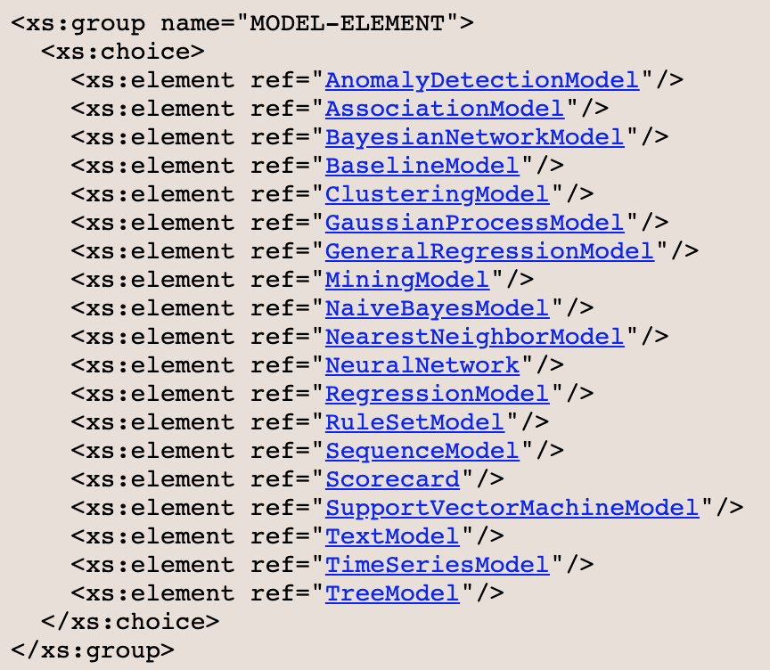
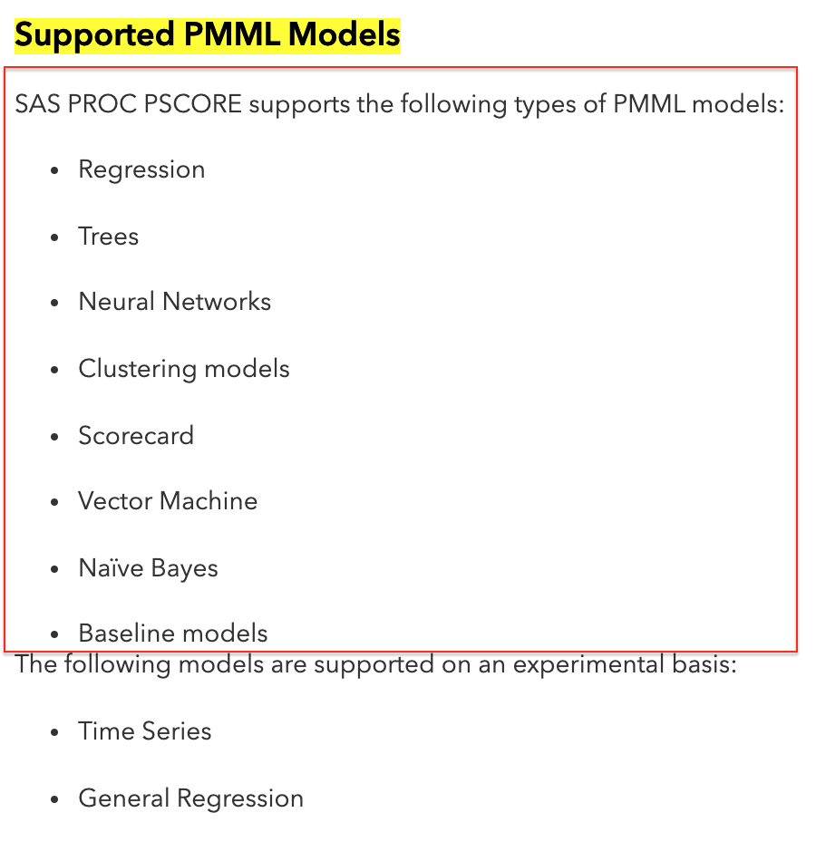
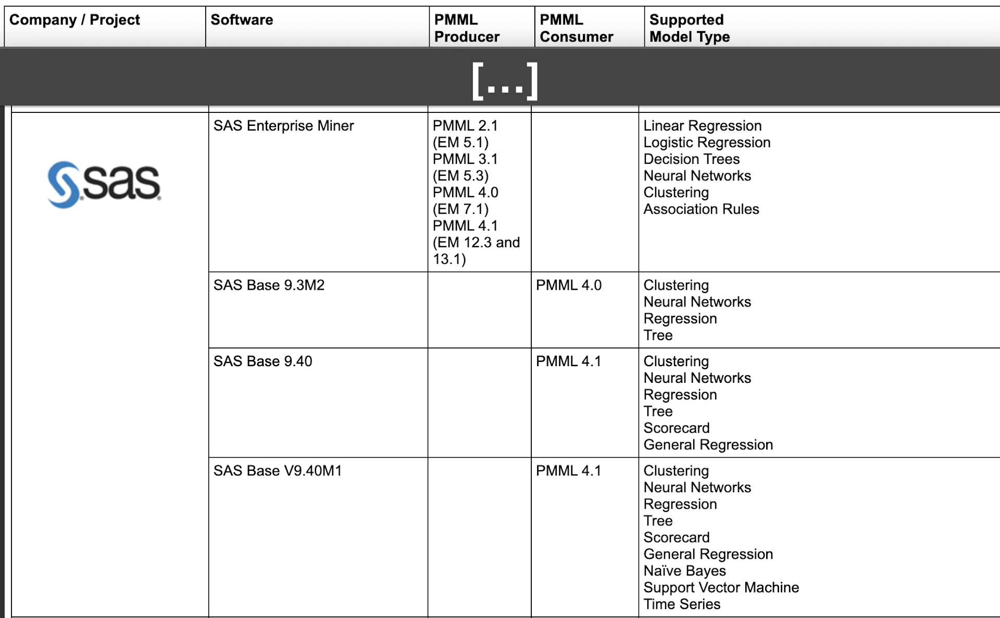

patryk.laskowski@ibm.com

---

# 1. PMML supporting libraries

#### A. [lightpmmlpredictor](https://github.com/ctrl-alt-d/lightpmmlpredictor)
But supports only PMML-4_1,<br>
and we have PMML-4_3.<br>
**❌ REJECTED**

#### B. [Augustus - open-source PMML toolkit written in Python](http://augustusdocs.appspot.com/docs/v06/model_abstraction/augustus_and_pmml.html)
[GitHub](https://github.com/modelop/augustus) page.<br>
But can't setup.<br>
**❌ REJECTED**

#### C. [openscoring-python](https://github.com/openscoring/openscoring-python)
But there is no free license.<br>
**❌ REJECTED**

#### D. [PyPmml](https://github.com/autodeployai/pypmml)
Which is simple and works!<br>
**✅ ACCEPTED**

---

# 2. PyPmml

## What is PyPmml?
### [autodeployai/pypmml](https://github.com/autodeployai/pypmml)

> PyPMML is a Python PMML scoring library, it really is the Python API for [PMML4S](https://github.com/autodeployai/pmml4s).

### What is PMML4S?
### [autodeployai/pmml4s](https://github.com/autodeployai/pmml4s)

> PMML4S is a PMML (Predictive Model Markup Language) scoring library for Scala. It provides both Scala and Java Evaluator API for PMML.

> PMML4S is a lightweight, clean and efficient implementation based on the PMML specification **from 2.0 through to the latest 4.4**.

## Example PyPmml code in Python.
Below code load PMML decision tree model and make prediction.

```python
>>> from pypmml import Model

>>> model = Model.load('Waga.xml')
>>> model.predict({'Wzrost': 180})
{'$RI-Waga': 24, '$R-Waga': 65.32}
>>> model.inputNames
['Wzrost']
>>> model.predict([180])
[65.32, 24]
>>> model.outputNames
['$R-Waga', '$RI-Waga']
```

Data in DataFrame form is also accepted.

```python
>>> import pandas as pd

>>> data = pd.DataFrame({
...     'Wzrost' : [180, 170, 160]})

>>> model.predict(data)
     $R-Waga  $RI-Waga
0  65.320000        24
1  57.190909        40
2  51.010526        17
```


---

# 3. Requirements for different model architectures

#### Note
In this case PMML models are going to be produced in SAS.<br>
Below compare <u>all possible models that PMML supports</u> with <u>all models that SAS may export in PMML format</u> with <u>all models that PyPmml Python library supports</u>

--- 

<table>
    <thead>
        <td>Idx</td>
        <td><a href="http://dmg.org/pmml/v4-4-1/GeneralStructure.html"><b>PMML models</b></a></td>
        <td><a href="http://dmg.org/pmml/products.html"><b>SAS Enterprise Miner</b></a><br>[PMML Producer]</td>
        <td><a href="https://documentation.sas.com/?docsetId=emref&docsetTarget=n0jswh909h49dnn1mq562smtf4jz.htm&docsetVersion=14.3&locale=en#n0c3huzrgucufxn1vldp1sa3bkep"><b>SAS Enterprise Miner 14.3</b></a></td>
        <td><a href="https://github.com/autodeployai/pypmml"><b>PyPMML</b></a><br>[Python Library]</td>
    </thead>
    <tr><td>1</td><td>AnomalyDetectionModel</td><td>-</td><td>-</td><td>✅ Anomaly Detection Models</td></tr>
    <tr><td>2</td><td>AssociationModel</td><td>✅ Association Rules</td><td>-</td><td>✅ Association Rules</td></tr>
    <tr><td>3</td><td>BayesianNetworkModel</td><td>-</td><td>-</td><td>❌ Bayesian Network</td></tr>
    <tr><td>4</td><td>BaselineModel</td><td>-</td><td>✅ Baseline models<br>[???]</td><td>❌ Baseline Models</td></tr>
    <tr><td>5</td><td>ClusteringModel</td><td>✅ Clustering</td><td>✅ Clustering models</td><td>✅ Cluster Models</td></tr>
    <tr><td>6</td><td>GaussianProcessModel</td><td>-</td><td>-</td><td>❌ Gaussian Process</td></tr>
    <tr><td>7</td><td>GeneralRegressionModel</td><td>-</td><td>-</td><td>✅ General Regression</td></tr>
    <tr><td>8</td><td>MiningModel</td><td>-</td><td>-</td><td>-</td></tr>
    <tr><td>9</td><td>NaiveBayesModel</td><td>-</td><td>✅ Naïve Bayes<br>[Consumer]</td><td>✅ Naive Bayes</td></tr>
    <tr><td>10</td><td>NearestNeighborModel</td><td>-</td><td>-</td><td>✅ k-Nearest Neighbors</td></tr>
    <tr><td>11</td><td>NeuralNetwork</td><td>✅ Neural Networks</td><td>✅ Neural Networks</td><td>✅ Neural Network</td></tr>
    <tr><td>12</td><td>RegressionModel</td><td>✅ Linear Regression<br>✅ Logistic Regression</td><td>✅ Regression</td><td>✅ Regression</td></tr>
    <tr><td>13</td><td>RuleSetModel</td><td>-</td><td>-</td><td>✅ Ruleset</td></tr>
    <tr><td>14</td><td>SequenceModel</td><td>-</td><td>-</td><td>❌ Sequences</td></tr>
    <tr><td>15</td><td>Scorecard</td><td>-</td><td>✅ Scorecard<br>[Consumer]</td><td>✅ Scorecard</td></tr>
    <tr><td>16</td><td>SupportVectorMachineModel</td><td>-</td><td>✅ Vector Machine<br>[Consumer]</td><td>✅ Vector Machine</td></tr>
    <tr><td>17</td><td>TextModel</td><td>-</td><td>-</td><td>❌ Text Models</td></tr>
    <tr><td>18</td><td>TimeSeriesModel</td><td>-</td><td>-</td><td>❌ Time Series</td></tr>
    <tr><td>19</td><td>TreeModel</td><td>✅ Decision Trees</td><td>✅ Trees</td><td>✅ Trees</td></tr>
</table>

---

# 3a. PMML models

[Website](http://dmg.org/pmml/v4-4-1/GeneralStructure.html)

- AnomalyDetectionModel
- AssociationModel
- BayesianNetworkModel
- BaselineModel
- ClusteringModel
- GaussianProcessModel
- GeneralRegressionModel
- MiningModel
- NaiveBayesModel
- NearestNeighborModel
- NeuralNetwork
- RegressionModel
- RuleSetModel
- SequenceModel
- Scorecard
- SupportVectorMachineModel
- TextModel
- TimeSeriesModel
- TreeModel



---

# 3b. SAS Enterprise Miner 14.3 PMML Support

[Website.](https://documentation.sas.com/?docsetId=emref&docsetTarget=n0jswh909h49dnn1mq562smtf4jz.htm&docsetVersion=14.3&locale=en#n0c3huzrgucufxn1vldp1sa3bkep) Look for "Supported PMML Models".

#### Supported PMML Models
SAS PROC PSCORE supports the following types of PMML models:
- Regression
- Trees
- Neural Networks
- Clustering models
- Scorecard
- Vector Machine
- Naïve Bayes
- Baseline models



---


# 3c. SAS Enterprise Miner

According to [this](http://dmg.org/pmml/products.html) website **SAS Enterprise Miner** can produce this models:
- Linear Regression
- Logistic Regression
- Trees
- Neural Networks
- Clustering
- Association Rules

with following .pmml versions: 
- PMML 2.1 (EM 5.1)
- PMML 3.1 (EM 5.3)
- PMML 4.0 (EM 7.1)
- PMML 4.1 (EM 12.3 and 13.1)



---

# Summary

PyPmml is a good solution that supports wide range of PMML versions and all desired models except Baseline Models.
This seems to be a great choice for this project!

---

patryk.laskowski@ibm.com
