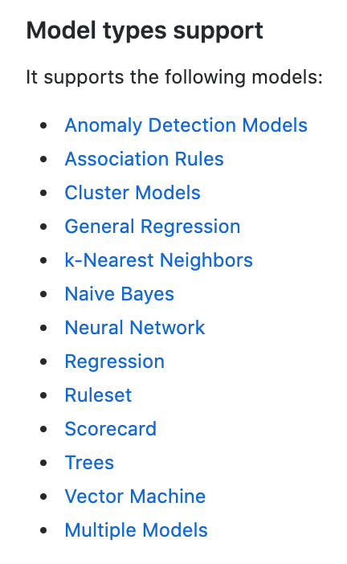

patryk.laskowski@ibm.com

---


# 1a. Python PMML supporting libraries

## A. [lightpmmlpredictor](https://github.com/ctrl-alt-d/lightpmmlpredictor)
But supports only PMML-4_1,<br>
and we have PMML-4_3.<br>

**❌ REJECTED**

## B. [Augustus - open-source PMML toolkit written in Python](http://augustusdocs.appspot.com/docs/v06/model_abstraction/augustus_and_pmml.html)
[GitHub](https://github.com/modelop/augustus) page.<br>
But can't setup.<br>

**❌ REJECTED**

## C. [openscoring-python](https://github.com/openscoring/openscoring-python)
But there is no free license.<br>

**❌ REJECTED**

## D. [pmml2sklearn](https://github.com/gokhangerdan/pmml2sklearn)
But parse pmml files and convert it to sklearn kmeans models.<br>

**❌ REJECTED**

## E. [sklearn-pmml-model](https://github.com/iamDecode/sklearn-pmml-model)
But supports only few models (Decision Trees, Random Forests (ensemble method), Linear Model (specifically: Linear Reg, Ridge, Lasso, ElasticNet), Gaussian Naive Bayes)<br>
Almost good...<br>

**❌ REJECTED**

## F. [PyPmml](https://github.com/autodeployai/pypmml)
Which is simple, supports almost all models on all PMML versions and works!<br>

**✅ ACCEPTED**

---


# 1b. R PMML supporting libraries

## A. [r-pmml](https://softwareag.github.io/r-pmml/index.html)

[GitHub](https://github.com/SoftwareAG/r-pmml)
[Supported models](https://softwareag.github.io/r-pmml/articles/packages_and_functions.html)<br>
Supports wide range of different model types (Anomaly Detection, Clustering, K Nearest Neighbors, Linear Models, etc.)<br>
<br>
But this is PMML **reader** for R language.
> This package contains functions to **export** various machine learning and statistical models **to PMML**, as well as generate data transformations in PMML format.<br>

**❌ REJECTED**

## B. [r2pmml](https://github.com/jpmml/r2pmml)

R package for **converting R models to PMML**. Requires Java.

**❌ REJECTED**

---


# 1c. Java PMML supporting libraries

## A. [jpmml-evaluator](https://github.com/jpmml/jpmml-evaluator)

> Java Evaluator API for Predictive Model Markup Language (PMML)<br>

Supported versions: PMML versions 3.0, 3.1, 3.2, 4.0, 4.1, 4.2, 4.3 and 4.4.<br>
Wide range of models supported (Association rules, Cluster model, General regression, Naive Bayes, k-Nearest neighbors, Neural network, etc.)<br>

**✅ ACCEPTED**

---
---

# 2. Python PyPmml [main solution]

## What is PyPmml?
### [autodeployai/pypmml](https://github.com/autodeployai/pypmml)

> PyPMML is a Python PMML scoring library, it really is the Python API for [PMML4S](https://github.com/autodeployai/pmml4s).

## What is PMML4S?
### [autodeployai/pmml4s](https://github.com/autodeployai/pmml4s)

> PMML4S is a PMML (Predictive Model Markup Language) scoring library for Scala. It provides both Scala and Java Evaluator API for PMML.
> PMML4S is a lightweight, clean and efficient implementation based on the PMML specification **from 2.0 through to the latest 4.4**.

## Example PyPmml code.
Below code load PMML decision tree model and make prediction.

```python
>>> from pypmml import Model

>>> model = Model.load('Waga.xml')
>>> model.predict({'Wzrost': 180})
{'$RI-Waga': 24, '$R-Waga': 65.32}
>>> model.inputNames
['Wzrost']
>>> model.predict([180])
[65.32, 24]
>>> model.outputNames
['$R-Waga', '$RI-Waga']
```

Data in Pandas `DataFrame` form is also accepted.

```python
>>> import pandas as pd

>>> data = pd.DataFrame({
...     'Wzrost' : [180, 170, 160]})

>>> model.predict(data)
     $R-Waga  $RI-Waga
0  65.320000        24
1  57.190909        40
2  51.010526        17
```


---

# 3. Support for model types

#### Note
In this case PMML models are going to be produced in SAS.<br>
Below compare all possible models that PMML supports with all models that SAS may export in PMML format with all models that PyPmml Python library as well as JPmml support.

--- 

<table>
    <thead>
        <td>Idx</td>
        <td><a href="http://dmg.org/pmml/v4-4-1/GeneralStructure.html"><b>All PMML models</b></a></td>
        <td><a href="http://dmg.org/pmml/products.html"><b>SAS Enterprise Miner</b></a><br><b>[PMML Producer]</b></td>
        <td><a href="https://documentation.sas.com/?docsetId=emref&docsetTarget=n0jswh909h49dnn1mq562smtf4jz.htm&docsetVersion=14.3&locale=en#n0c3huzrgucufxn1vldp1sa3bkep"><b>SAS Enterprise Miner 14.3</b></a><br>[PMML Consumer/Producer]</td>
        <td><a href="https://github.com/autodeployai/pypmml"><b>PyPMML</b></a><br>[Python Library]</td>
        <td><a href="https://github.com/jpmml/jpmml-evaluator"><b>JPMML-Evaluator</b></a><br>[Java Evaluator]</td>
    </thead>
    <tr>
      <td>1</td>
      <td>AnomalyDetectionModel</td>
      <td>-</td>
      <td>-</td>
      <td>✅ Anomaly Detection Models</td>
      <td>-</td>
    </tr>
    <tr>
      <td>2</td>
      <td>AssociationModel</td>
      <td>✅ Association Rules</td>
      <td>-</td>
      <td>✅ Association Rules</td>
      <td>✅ Association rules</td>
    </tr>
    <tr>
      <td>3</td>
      <td>BayesianNetworkModel</td>
      <td>-</td>
      <td>-</td>
      <td>❌ Bayesian Network</td>
      <td>-</td>
    </tr>
    <tr>
      <td>4</td>
      <td>BaselineModel</td>
      <td>-</td>
      <td>✅ Baseline models<br>[???]</td>
      <td>❌ Baseline Models</td>
      <td>-</td>
    </tr>
    <tr>
      <td>5</td>
      <td>ClusteringModel</td>
      <td>✅ Clustering</td>
      <td>✅ Clustering models</td>
      <td>✅ Cluster Models</td>
      <td>✅ Cluster model</td>
    </tr>
    <tr>
      <td>6</td>
      <td>GaussianProcessModel</td>
      <td>-</td>
      <td>-</td>
      <td>❌ Gaussian Process</td>
      <td>-</td>
    </tr>
    <tr>
      <td>7</td>
      <td>GeneralRegressionModel</td>
      <td>-</td>
      <td>-</td>
      <td>✅ General Regression</td>
      <td>✅ General regression</td>
    </tr>
    <tr>
      <td>8</td>
      <td>MiningModel</td>
      <td>-</td>
      <td>-</td>
      <td>-</td>
    </tr>
    <tr>
      <td>9</td>
      <td>NaiveBayesModel</td>
      <td>-</td>
      <td>✅ Naïve Bayes<br>[PMML Consumer]</td>
      <td>✅ Naive Bayes</td>
      <td>✅ Naive Bayes</td>
    </tr>
    <tr>
      <td>10</td>
      <td>NearestNeighborModel</td>
      <td>-</td>
      <td>-</td>
      <td>✅ k-Nearest Neighbors</td>
      <td>✅ k-Nearest neighbors</td>
    </tr>
    <tr>
      <td>11</td>
      <td>NeuralNetwork</td>
      <td>✅ Neural Networks</td>
      <td>✅ Neural Networks</td>
      <td>✅ Neural Network</td>
      <td>✅ Neural Networks</td>
    </tr>
    <tr>
      <td>12</td>
      <td>RegressionModel</td>
      <td>✅ Linear Regression<br>✅ Logistic Regression</td>
      <td>✅ Regression</td>
      <td>✅ Regression</td>
      <td>✅ Regression</td>
    </tr>
    <tr>
      <td>13</td>
      <td>RuleSetModel</td>
      <td>-</td>
      <td>-</td>
      <td>✅ Ruleset</td>
      <td>✅ Rule set</td>
    </tr>
    <tr>
      <td>14</td>
      <td>SequenceModel</td>
      <td>-</td>
      <td>-</td>
      <td>❌ Sequences</td>
      <td>-</td>
    </tr>
    <tr>
      <td>15</td>
      <td>Scorecard</td>
      <td>-</td>
      <td>✅ Scorecard<br>[PMML Consumer]</td>
      <td>✅ Scorecard</td>
      <td>✅ Scorecard</td>
    </tr>
    <tr>
      <td>16</td>
      <td>SupportVectorMachineModel</td>
      <td>-</td>
      <td>✅ Vector Machine<br>[PMML Consumer]</td>
      <td>✅ Vector Machine</td>
      <td>✅ Support Vector Machine</td>
    </tr>
    <tr>
      <td>17</td>
      <td>TextModel</td>
      <td>-</td>
      <td>-</td>
      <td>❌ Text Models</td>
      <td>-</td>
    </tr>
    <tr>
      <td>18</td>
      <td>TimeSeriesModel</td>
      <td>-</td>
      <td>-</td>
      <td>❌ Time Series</td>
      <td>✅ Time Series</td>
    </tr>
    <tr>
      <td>19</td>
      <td>TreeModel</td>
      <td>✅ Decision Trees</td>
      <td>✅ Trees</td>
      <td>✅ Trees</td>
      <td>✅ Tree Model</td>
    </tr>
</table>

---

# 3a. All PMML models

[Documentation](http://dmg.org/pmml/v4-4-1/GeneralStructure.html) points these models as supported by PMML format.

<p align='center'></p>

---

# 3b. SAS Enterprise Miner

According to [this](http://dmg.org/pmml/products.html) website **SAS Enterprise Miner can produce** this models:

<p align='center'></p>

---

# 3c. SAS Enterprise Miner 14.3 PMML Support

[Website.](https://documentation.sas.com/?docsetId=emref&docsetTarget=n0jswh909h49dnn1mq562smtf4jz.htm&docsetVersion=14.3&locale=en#n0c3huzrgucufxn1vldp1sa3bkep) Look for "Supported PMML Models".

SAS PROC PSCORE supports the following types of PMML models:

<p align='center'></p>

This means that SAS in general is able to handle either **import or export** of above.

---

# 3d. Python PyPmml 

Supports following models:

<p align='center'></p>

---

# 3e. Java jpmml-evaluator

Evaluate: 

<p align='center'></p>

---

# Summary

PyPmml is a good solution that supports wide range of PMML versions and all desired models except Baseline Models.
This seems to be a great choice for this project!

---

patryk.laskowski@ibm.com
